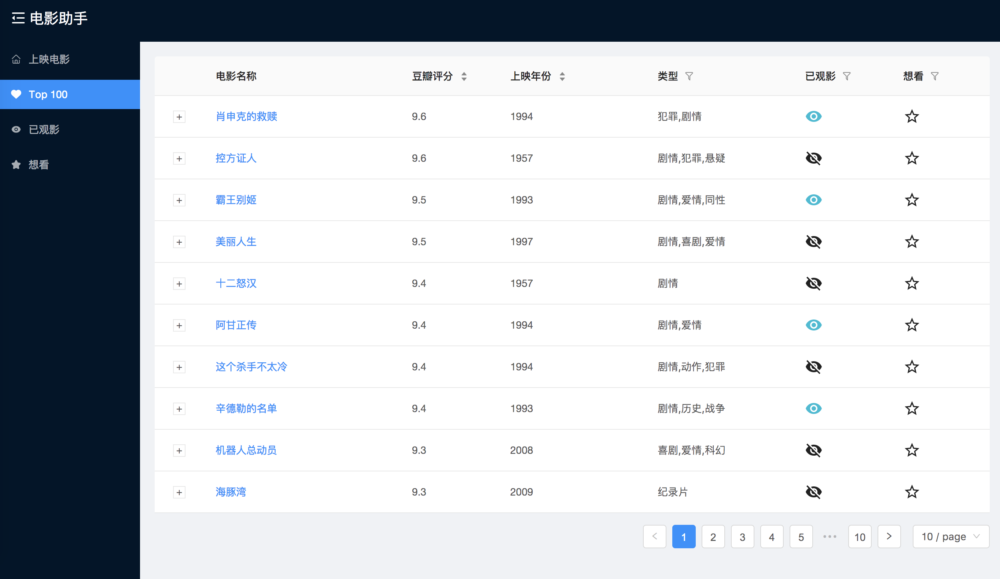

# Movie Helper

## How to use
1. configure you database name (an empty database) in application.properties
2. start the web app in IDE
3. open browser: http://localhost:8080

## Implement
### Back end
- Kotlin: refactor back end code
    1. easy to understand
    2. improve the code quality

### [Front end](https://github.com/zzh1991/React-SpringBoot/blob/master/README.md)
This repository has packaged the Javascript code
- React
- Ant Design

## Demo: Movie Helper
### Recent Movies

### Top 100 Movies
