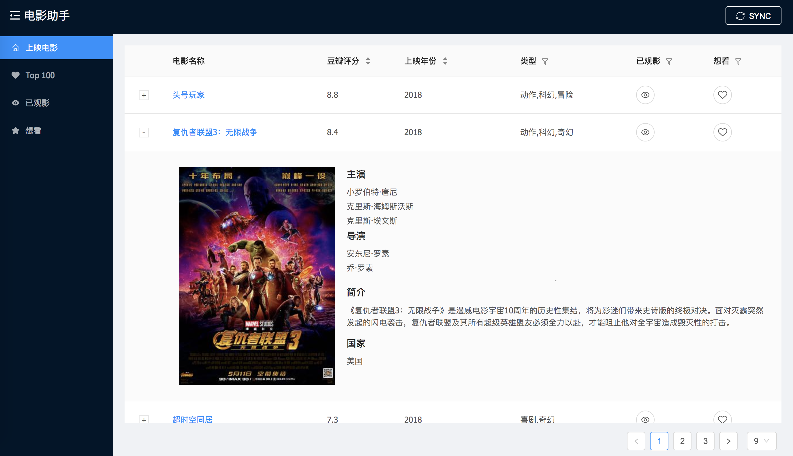
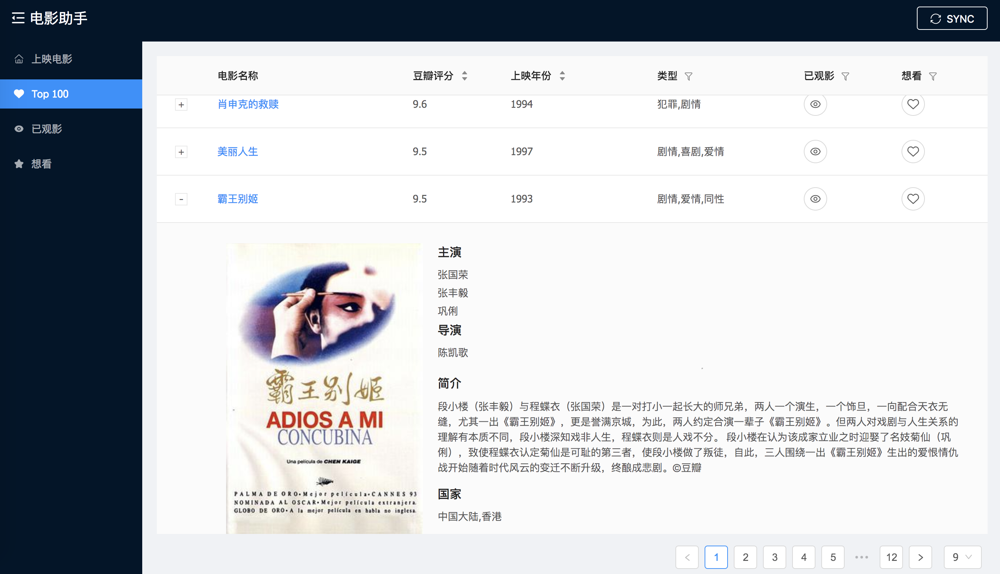

<p align="center">
    <a href="http://movie.zzhpro.com">
        
    </a>
    <h3 align="center">Movie Helper</h3>
    <p align="center">
        <a href="https://github.com/zzh1991/Movie-Helper/blob/master/LICENSE"></a>
        <a href="#"></a>
        <a href="#"></a>
        <a href="#"></a>
        <a href="https://github.com/zzh1991/Movie-Helper/blob/master/.travis.yml"></a>
    </p>
    <p align="center">
        Movie management and find valueable movies to watch<br>
    </p>
</p>

## How to use
1. `git clone --recursive git@github.com:zzh1991/Movie-Helper.git`
```bash
# or
git clone git@github.com:zzh1991/Movie-Helper.git
git submodule init
git submodule update
```
1. configure you database name (an empty database), user, password in `src/main/resources/application.properties`
2. cd front
3. yarn: install dependency
3. yarn start: open the front app
4. start the web app in IDE
5. go to [http://localhost:3000](http://localhost:3000)

### update submodule
```bash
cd front
git fetch origin master
git rebase origin/master

# or
git submodule update --remote front
```

## How to deploy
1. cd front
1. yarn deploy
1. cd ../
2. mvn install

## Implement
### Back end
- Kotlin: refactor back end code
    1. easy to understand
    2. improve the code quality

### [Front end](https://github.com/zzh1991/movie-helper-front)
This repository has packaged the Javascript code
- React 16
- Ant Design 3

## Demo: [Movie Helper](http://movie.zzhpro.com)
### Recent Movies

### Top 100 Movies


## Others
### submodule detail
git submodule add git@github.com:zzh1991/movie-helper-front.git front
